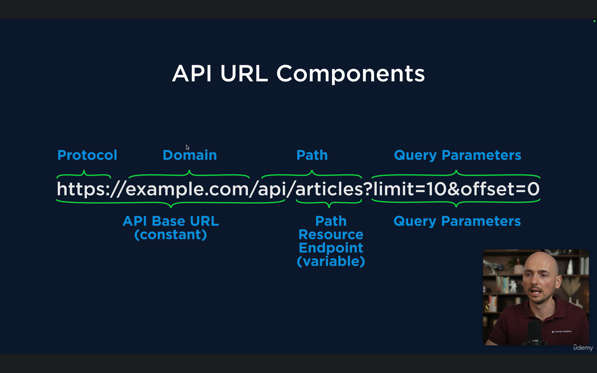

# Cypress
- What is Cypress?


### Limitation of a Cypress
1. Can't switch between the browser windows.
2. Limited iFrame support.
3. Prallel execution in Cypress Cloud.


### Aplication use in node js
` https://playground.bondaracademy.com/pages/iot-dashboard `
` https://conduit.bondaracademy.com/ `
` https://docs.cypress.io/api/commands/document `
### process to setup the Cypress 
- first to start the node js
` npm init `

- second is to install Cypress in your project
` npm install cypress --save-div `

- Third is to start the execution in the cypress
` npx cypress open `
` npx cypress run `


### Cypress basics
##### Starting of a Test case in the new file
```
describe('Test sute1', () => {
    beforeEach('Open application page', () => {
        cy.visit('/')
        cy.contains('Forms').click()
        cy.contains('Form Layouts').click()
    })

    it("Hello world 2", () => {
        cy.get('[id="inputEmail1"]')
        cy.get('#inputPassword2')
    })
```
1. cypress tests start from 
                    ```
                    it('name of the test ', ()=>{
                        //here we write the tests
                    })
                    ```

### locator in cypress

               1. by tag
                    cy.get('input')

               2. by id
                    cy.get('#value')
                  
               3. by class value
                    cy.get('.input-full-width')

               4. by attribute
                    cy.get('[attribute value]')
                    
               5. combine attribute
                    cy.get('[attri 1][attri 2]')

### Locator to find the parent  
               1. cy.get('locator').parents('locator').find('type')

  - This is use for to find the next element in the locator field.
               2. cy.get('locator').parent().find('type') 
               
  - It like it is use to go one level up like if we type the parent() one more time then it will be going 2 time up.
               3. cy.get('locator').parent().parent().find('type') 

  - For going until the desire parent() is not found then we use a parentUntil() method.
               4. cy.get('locator').parentUntil('TheLocatorForThePrents').find('type')

### Cypress chain 
  - For the cypress chain we need to continue the execution until there is no stoping in the code like some line not giveing the output for the code

              
               it('Cypress chain command', ()=> {
               cy.get('#inputEmail1')
               .parents('form')
               .find('button')
               .click()

               cy.get('#inputEmail1')
               .parents('form')
               .find('nb-radio')
               .first()
               .should('contain.text', 'Option 1')
                })

#### For Accertion in the Cpress we use the should method

### Reusing the locators
  -  Method 1
               For Reusing locator GLOBALY we use a as() to work as a variable for the locator.
               
               cy.get('#inputEmail1').as('input1')
               cy.get('@input1')
               .parents('form')
               .find('button')
               .click()
  - Method 2
               By using the JQuery method using the then() method. 

                 cy.get('#inputEmail1').then(input2 => {
                    cy.wrap(input2)
                         .parents('form')
                         .find('button')
                         .click()
                 })


### Extracting the value from the web page 
```
it.only('Extreating values', function () {
- // By using the JQuery method
        cy.get('[for="exampleInputEmail1"]').then(name => {
            const text1 = name.text()
            console.log(text1)
        })

- // Using the invoke method 
        cy.get('[for="exampleInputEmail1"]').invoke('text').then(name2 => {
            console.log(name2)
        })
        cy.get('[for="exampleInputEmail1"]').should('contain', 'Email address')

- // Using the invoke + Alise method means by using as() method
        cy.get('[for="exampleInputEmail1"]').invoke('text').as('name3')
        console.log('name3')

- // Using the invoke to get the attribute value print in the console
        cy.get('#exampleInputEmail1').invoke('attr' , 'class').then(className => {
            console.log(className)
        })

- // For invoking the input field value 
        cy.get('#exampleInputEmail1').type('shubham@gmail.com')
        cy.get('#exampleInputEmail1').invoke('prop', 'value').then(value1 => {
            console.log(value1)
        })
    }) 
```  

### Cypress Assertions 
```         
      it.only('Assertion in cypress', function(){
- // by using the contains method
                    cy.get('[for="exampleInputEmail1"]').should('contain', 'Email address')
                    cy.get('[for="exampleInputEmail1"]').then(name => {
                         expect(name).to.contain('Email address')
                    })

- // By using the have.text method 
                    cy.get('[for="exampleInputEmail1"]').should('have.text', 'Email address')
                    cy.get('[for="exampleInputEmail1"]').then(name => {
                         expect(name).to.have.text('Email address')
                    })
                    
- // If the variable alresy have a text then there is no need to use a have text
                    cy.get('[for="exampleInputEmail1"]').invoke('text').then(name2 => {
                         console.log(name2)
                         expect(name2).to.equal('Email address')
                         cy.wrap(name2).should('equal', 'Email address')
                    })
- // go to the Cypress doc to find the all available assertions
               }) 

```
### Time out in the Cypress

        it.only('Cypress timeOut', function () {
        cy.get('[title="Modal & Overlays"]').click()
        cy.get('[title="Dialog"]').click()

 - // without time out using the default timeOut that is 4000ms

        cy.contains('Open with delay 3 seconds').click()
        cy.get('nb-dialog-container nb-card-header').should('have.text', 'Friendly reminder')
        cy.get('nb-card-footer [class="appearance-filled size-medium shape-rectangle status-basic nb-transition"]').click()

 - // With timeOut of a 11000ms

        cy.contains('Open with delay 10 seconds').click()
        cy.get('nb-dialog-container nb-card-header', { timeout: 11000 }).should('have.text', 'Friendly reminder')
        cy.get('nb-card-footer [class="appearance-filled size-medium shape-rectangle status-basic nb-transition"]').click()


    })

### Add {delay:.....}
 - to add delay in the program we use a {delay:200} funtion inside the method
          cy.get('Email').type('shubham@gmail.com',{delay:300}).clear()

### To handle the Radio button 
```
it('radio button handling', function(){
        cy.get('nb-radio-group nb-radio').find('[type="radio"]').then(allRadioButton =>{
            cy.wrap(allRadioButton).eq(0).check({force:true}).should('be.checked')
            cy.wrap(allRadioButton).eq(1).check({force:true}).should('be.checked')
            cy.wrap(allRadioButton).eq(0).should('not.be.checked')
            cy.wrap(allRadioButton).eq(2).should('be.disabled')

        })
    })
```

### To handle the checked box
```
it('checkbox handling', function(){
        cy.get('[title="Modal & Overlays"]').click()
        cy.get('[title="Toastr"]').click()

        cy.get('[class="col-md-6 col-sm-12"] div').find('[type="checkbox"]').then(allCheckBoxes => {
            cy.wrap(allCheckBoxes).eq(1).check({force:true})
            cy.wrap(allCheckBoxes).uncheck({force:true}).should('not.be.checked')
            cy.wrap(allCheckBoxes).check({force:true})

        })
    })
```
### To handle the dropdown using cypress
```
it.only('Handle the costome and native dropdown', function () {
        cy.get('[title="Modal & Overlays"]').click()
        cy.get('[title="Toastr"]').click()

        cy.contains('div', 'Toast type:').find('select').select('info').should('have.value', 'info')
        cy.contains('div', 'Position:').find('nb-select').click()
        cy.contains('bottom-right').click()
        cy.contains('div', 'Position:').find('nb-select').click().should('contain.text', 'bottom-right')

        // to select the dropdown each element in it

        cy.contains('div', 'Position:').find('nb-select').then(allDropDown => {
            cy.wrap(allDropDown).click()
            cy.get('.option-list nb-option').each((option, index, list) => {
                cy.wrap(option).click()
                if(index < list.length-1)
                    cy.wrap(allDropDown).click()
            })
        })


    })
```
### Hnadle the toolTip 
```
   it.only('Handle the toolTip', function(){
        cy.get('[title="Modal & Overlays"]').click()
        cy.get('[title="Tooltip"]').click()

        cy.contains('button', 'Top').trigger('mouseenter')
        cy.get('nb-tooltip').should('have.text', 'This is a tooltip')
    })
```

### Alert Handling
```
 it.only('Alert handling ', function(){
        cy.get('[title="Tables & Data"]').click()
        cy.get('[title="Smart Table"]').click()

        
        cy.window().then(win => {
            cy.stub(win, 'confirm').as('Alert').returns(true)

            cy.get('[class="nb-trash"]').first().click()
            cy.get('@Alert').should('be.calledWith', 'Are you sure you want to delete?')

        })
    })
```

### handling the table 
```
it('Table Handling', function () {
        cy.get('[title="Tables & Data"]').click()
        cy.get('[title="Smart Table"]').click()

        //1.
        // first we need to enter in the table row then we need to perform the ask in the row by using the then funtion 
        cy.get('tbody').contains('tr', 'Sparrow').then(tableRow => {
            cy.wrap(tableRow).find('.nb-edit').click()
            cy.wrap(tableRow).find('[placeholder="Age"]').clear().type('40')
            cy.wrap(tableRow).find('.nb-checkmark').click()
            cy.wrap(tableRow).find('td').last().should('have.text', '40')
        })

        // 2. How to find by the index
        cy.get('.nb-plus').click()
        cy.get('thead tr').eq('2').then(tableRow2 => {
            cy.wrap(tableRow2).find('[placeholder="First Name"]').type('shubham')
            cy.wrap(tableRow2).find('[placeholder="Last Name"]').type('Bhuvad')
            cy.wrap(tableRow2).find('[placeholder="Username"]').type('shubham123')
            cy.wrap(tableRow2).find('[placeholder="E-mail"]').type('shubhambhuvad@gmail.com')
            cy.wrap(tableRow2).find('[placeholder="Age"]').type('24')
            cy.wrap(tableRow2).find('.nb-checkmark').click()
        })
    })
```

### How to handle the slider
```

    it.only('Slider', function () {
        cy.get('[tabtitle="Temperature"] circle')
        .invoke('attr','cx','117.31')
        .invoke('attr','cy','13.3504484307248')
        .click()
       
    })
```

### Handle the drag and drop 
```
 it.only('Handling the drag and drop events', function(){
        cy.contains('Extra Components').click()
        cy.contains('Drag & Drop').click()

        cy.get('#todo-list div').first().trigger('dragstart')
        cy.get('#drop-list').trigger('drop')

    })
```

## Page Object Model
#### pageObjectModel Class
```

class Navigation {
    tostrPage() {
        cy.get('[title="Modal & Overlays"]').click()
        cy.get('[title="Toastr"]').click()
    }

    formLayoutPage() {
        cy.contains('Forms').click()
        cy.contains('Form Layouts').click()
    }

    toolTipPage() {
        cy.get('[title="Modal & Overlays"]').click()
        cy.get('[title="Tooltip"]').click()
    }

    datePickerPage() {
        cy.contains('Forms').click()
        cy.contains('Datepicker').click()

    }
}
export const navigateTo = new Navigation()
```

#### Page object model 2
```

class FormLayoutPage {
    FormFillingInput(email, password, optionIndex){
        cy.get('[id="inputEmail1"]').type(email)
        cy.get('[id="inputPassword2"]').type(password)
        cy.get('[type="radio"]').eq(optionIndex).check({force:true})
        cy.get('[type="submit"]').click
    }
}

export const formFillingMethod = new FormLayoutPage()

```

#### Test class
```
/// <reference types="cypress" />

const { formFillingMethod } = require("./page-objects/Form-Layout-page")
const { navigateTo } = require("./page-objects/Navigation")

describe('Test suit 1', function(){
    it('Test1', function(){
        cy.visit('/')
        navigateTo.datePickerPage()
        navigateTo.formLayoutPage()
        navigateTo.toolTipPage()
        navigateTo.tostrPage()
    })

    it.only('FillingForms', function(){
        cy.visit('/')   
        navigateTo.formLayoutPage()
        formFillingMethod.FormFillingInput('shubhambhuvad70282@gmail.com','1234567','1')

    })
})
```

# API Testing Using the Cypress
